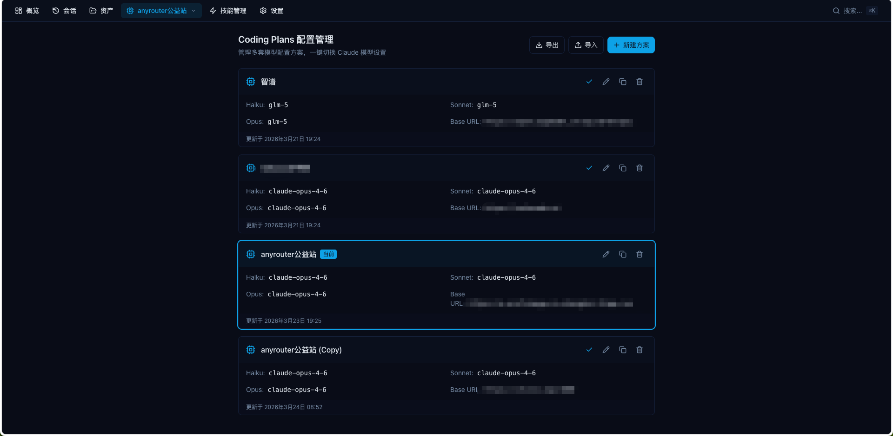
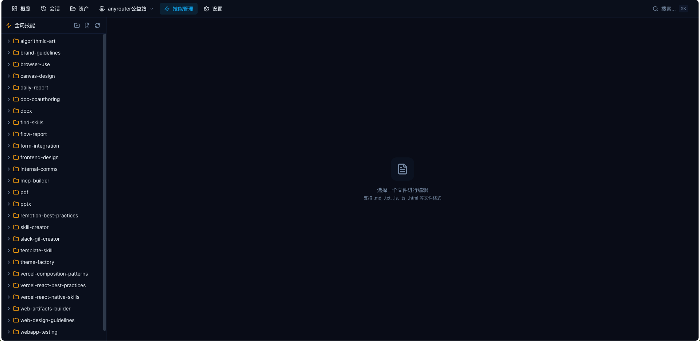

# Claude Insight

完全本地化的 Claude Code 对话历史管理与分析工具。帮助开发者浏览、搜索、分析与 Claude Code CLI 的完整对话历史，管理 Agents、Commands、Skills 等资产，并通过 Dashboard 获得使用洞察。

> **所有数据仅存储在本地**，不会上传到任何服务器。统计数据和会话数据不一定全面，以真实数据为准。

## 平台支持

| 平台 | 状态 | 说明 |
|------|------|------|
| **macOS** | 完全支持 | 主要开发和测试平台 |
| **Linux** | 完全支持 | 路径结构与 macOS 一致，开箱即用 |
| **Windows** | 基本支持 | 可正常运行，部分中文项目路径的编码解析可能存在兼容性问题 |

- 无原生依赖，所有依赖均为纯 JS/TS 实现，无需编译
- 无数据库，纯文件系统操作，零配置开箱即用
- 路径服务内置 `win32` / `darwin` / `linux` 平台检测，使用 `os.homedir()` 自动定位 `~/.claude` 目录
- 支持用户自定义 `.claude` 目录路径，兼容非默认安装位置


## 功能特性

### Dashboard 概览

- 总会话数、总消息数、活跃天数、首次使用日期
- 近 7 天活跃度统计 & 最长会话信息
- 按模型分类的 Token 用量统计（input / output / cache tokens）
- 日历活跃热力图 & 24 小时活跃分布图
- MCP 服务器状态面板
- 最近会话时间线，可快速跳转

### 会话浏览与详情

- **项目浏览器侧边栏**：按项目组织所有会话，支持项目筛选
- **全局时间线**：跨项目的会话分页列表
- **消息智能分类**：自动识别 7 种消息类型（用户文本、助手文本、工具调用、系统事件、中断、错误、聊天），过滤系统噪音
- **工具调用分组**：tool_use 与 tool_result 配对展示，支持截断输出按需加载
- **联动工具识别**：MCP、Agent、Skill 工具调用自动识别并标记图标与颜色
- **助手回合容器**：将助手的连续响应（文本 + 工具调用）包装为完整的"回合"，显示模型名称和 Token 汇总
- **多智能体支持**：主干 (trunk) + 子代理 (subagents) 消息合并时间线
- **Markdown 渲染 + 代码高亮**（Shiki）
- **图片支持**：内联显示 base64 和 URL 图片

### 会话联动分析

- 自动从会话中提取 Skills、Agents、MCP 服务器、Commands、Models 的使用记录
- 顶部上下文信息栏 (ContextBar) 展示联动摘要
- 侧边面板查看详细的 Skill/Agent/MCP/Task/FileHistory 信息
- 文件版本追踪：在工具操作旁内联显示文件变更版本徽章

### 会话对比

- 选择两个会话并排对比
- 对比维度：消息数量、Token 用量、会话时长、工具调用次数

### 全局搜索 (Cmd+K)

- 跨会话全文搜索
- 同时搜索 Agents、Commands、Skills、Plans
- 关键词高亮 & 按类型筛选
- 搜索结果点击可直接跳转

### 任务管理

- 跨会话聚合所有 Tasks 和 TODOs
- 按状态过滤（全部 / 待处理 / 进行中 / 已完成）
- 每条任务可跳转到对应会话

### 资产管理

管理 `~/.claude/` 目录下的各类资产：

| 资产类型 | 功能 |
|---------|------|
| **Agents** | 文件树浏览、Monaco Editor 编辑、创建/删除 |
| **Commands** | 文件树浏览、Monaco Editor 编辑、创建/删除 |
| **Output Styles** | 查看/编辑/删除输出风格 |
| **Plugins** | 已安装列表、市场列表、黑名单管理、启用/禁用切换 |
| **Plans** | 计划文件列表和详情查看 |
| **配置备份** | 备份列表、备份间 Diff 对比、备份 vs 当前配置对比 |
| **调试日志** | 调试日志文件浏览 |
| **文件变更历史** | 按会话分组的文件修改历史，版本间 Diff 对比 |

### 技能管理

- 浏览和编辑全局技能（`~/.claude/skills/`）和项目技能
- 文件树导航，支持 .md / .js / .ts / .json 等格式
- Monaco Editor 实时编辑
- 创建/删除文件和目录

### 模型配置管理

- 多配置方案管理（Haiku / Sonnet / Opus 模型名、Auth Token、Base URL）
- 一键激活方案（写入 `~/.claude/settings.json`）
- 顶栏快速切换配置
- 导出/导入配置方案（JSON 格式）

### 会话导入/导出

- 导出选定会话或整个项目为 ZIP
- 可选包含关联的 Skills / Agents / Commands 资产
- 导出包含 manifest.json 清单文件
- 支持 ZIP 文件导入到指定项目

### 设置

- 自定义 `.claude` 目录路径（支持非默认位置）
- 环境变量管理
- 配置 Diff 查看

## 技术栈

### 后端

- [Fastify](https://fastify.dev/) - 高性能 Web 框架
- [TypeScript](https://www.typescriptlang.org/) - 类型安全
- 无数据库设计，纯文件系统扫描

### 前端

- [Vue 3](https://vuejs.org/) - Composition API + `<script setup>`
- [TypeScript](https://www.typescriptlang.org/) - 类型安全
- [Vite](https://vitejs.dev/) - 构建工具
- [Pinia](https://pinia.vuejs.org/) - 状态管理
- [Tailwind CSS](https://tailwindcss.com/) - 实用优先 CSS
- [Radix Vue](https://www.radix-vue.com/) - 无样式 UI 组件库
- [Monaco Editor](https://microsoft.github.io/monaco-editor/) - 代码编辑器
- [Chart.js](https://www.chartjs.org/) - 图表库
- [Shiki](https://shiki.style/) - 代码高亮
- [markdown-it](https://github.com/markdown-it/markdown-it) - Markdown 渲染
- [Lucide](https://lucide.dev/) - 图标库

### 包管理

- [pnpm](https://pnpm.io/) - Monorepo workspace 模式

## 项目结构

```
claude-insight/
├── backend/                        # 后端服务
│   └── src/
│       ├── index.ts                # 服务入口 (默认 localhost:3000)
│       ├── app.ts                  # Fastify 应用 & 路由注册
│       ├── routes/
│       │   ├── history.ts          # 历史记录/项目/会话/搜索/导入导出
│       │   ├── skills.ts           # 技能文件 CRUD
│       │   ├── config.ts           # Claude 模型配置
│       │   ├── settings.ts         # 应用设置
│       │   ├── stats.ts            # Dashboard 统计数据
│       │   └── assets.ts           # 资产管理 (Agents/Commands/Styles/Plugins...)
│       ├── services/
│       │   ├── fileScanner.ts      # JSONL 会话扫描/解析/搜索/Token 统计
│       │   ├── pathService.ts      # 路径探测
│       │   ├── configService.ts    # 配置读写
│       │   ├── specScanner.ts      # CLAUDE.md 规范文件扫描
│       │   ├── skillScanner.ts     # 技能扫描
│       │   ├── skillFileManager.ts # 技能文件 CRUD
│       │   ├── assetScanner.ts     # 资产扫描
│       │   ├── linkageService.ts   # 会话联动分析
│       │   ├── statsService.ts     # 统计聚合服务
│       │   └── backupService.ts    # 备份/文件历史服务
│       └── types/
│           └── session.ts          # 核心类型定义
│
├── frontend/                       # 前端应用
│   └── src/
│       ├── views/                  # 页面视图 (8 个)
│       │   ├── DashboardView.vue   # 首页概览
│       │   ├── HistoryView.vue     # 会话浏览
│       │   ├── CompareView.vue     # 会话对比
│       │   ├── TasksView.vue       # 任务管理
│       │   ├── AssetsView.vue      # 资产管理
│       │   ├── PluginsView.vue     # 技能管理
│       │   ├── ModelProfilesView.vue # 模型配置
│       │   └── SettingsView.vue    # 设置
│       ├── components/             # UI 组件
│       │   ├── conversation/       # 会话相关 (消息/工具/联动/版本)
│       │   ├── dashboard/          # Dashboard (统计卡片/热力图/图表)
│       │   ├── layout/             # 布局 (导航/侧边栏)
│       │   ├── search/             # 全局搜索
│       │   ├── project/            # 项目概览
│       │   ├── assets/             # 资产管理组件
│       │   ├── linkage/            # 联动面板
│       │   ├── panels/             # 侧边面板
│       │   ├── settings/           # 设置组件
│       │   ├── model/              # 模型配置
│       │   ├── skills/             # 技能树
│       │   └── ui/                 # 通用 UI
│       ├── stores/                 # Pinia 状态管理
│       ├── api/                    # API 调用层
│       ├── composables/            # 组合式函数
│       └── types/                  # TypeScript 类型
│
└── package.json                    # Monorepo 根配置
```

## 快速开始

### 环境要求

- Node.js >= 18.0.0
- pnpm >= 8.0.0

### 安装

```bash
pnpm install
```

### 运行

```bash
# 并行运行前后端
pnpm dev

# 单独运行后端 (默认 http://localhost:3000)
pnpm dev:backend

# 单独运行前端 (默认 http://localhost:5173)
pnpm dev:frontend
```

### 构建

```bash
pnpm build
```

## 开发命令

| 命令 | 说明 |
|------|------|
| `pnpm dev` | 并行运行前后端开发服务器 |
| `pnpm dev:backend` | 单独运行后端 |
| `pnpm dev:frontend` | 单独运行前端 |
| `pnpm build` | 构建前后端项目 |
| `pnpm lint` | 代码检查 |
| `pnpm typecheck` | 类型检查 |
| `pnpm clean` | 清理构建产物 |

## 架构设计

- **无数据库**：所有数据来源于 `~/.claude/` 文件系统实时扫描，零配置开箱即用
- **JSONL 流式解析**：使用 `readline` + `createReadStream` 流式读取大型会话文件，避免内存溢出
- **消息智能分类**：正则模式匹配系统自动区分用户真实输入和系统注入噪音
- **多策略路径解析**：3 层查找策略处理中文路径编码差异
- **联动分析引擎**：自动从 JSONL 消息中提取 Skill / Agent / MCP / Command / Model 使用记录
- **Token 逐级聚合**：消息级 -> 会话级 -> 项目级 -> 全局级

## 页面预览





## Links

- [linux.do](https://linux.do/t/topic/1794151/9)

## License

MIT
