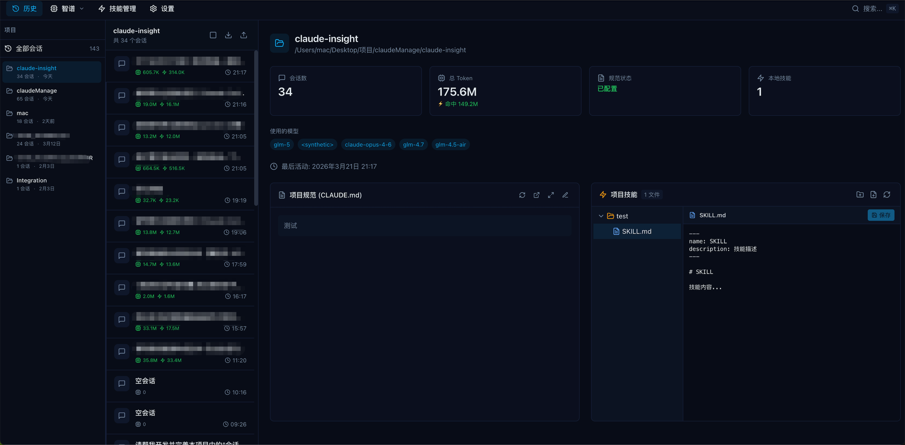
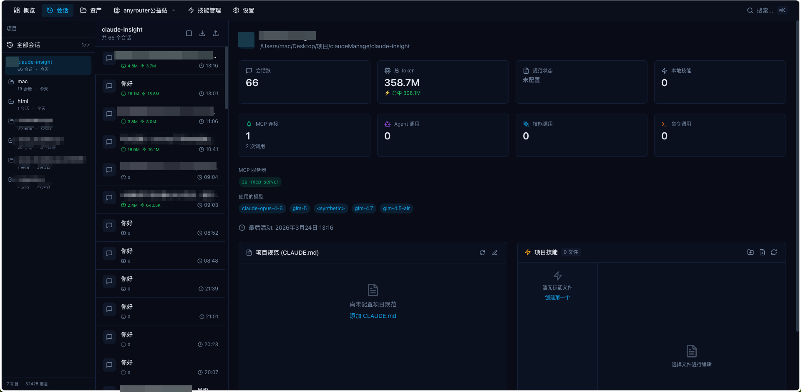
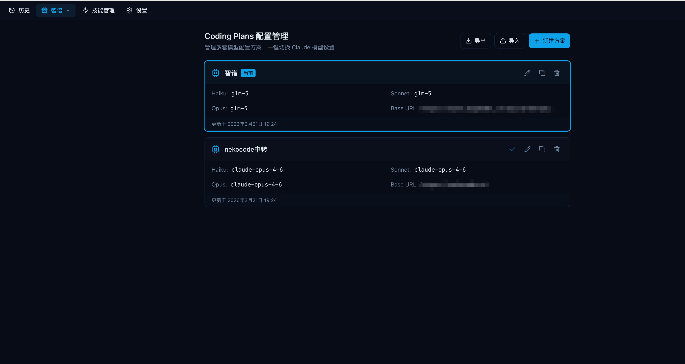
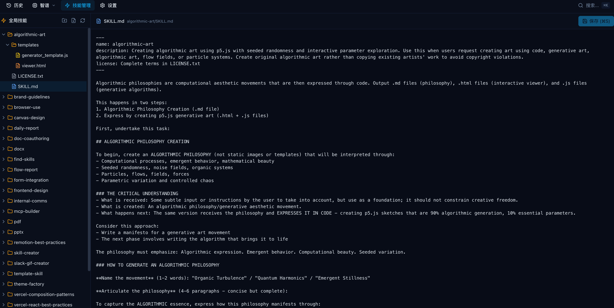
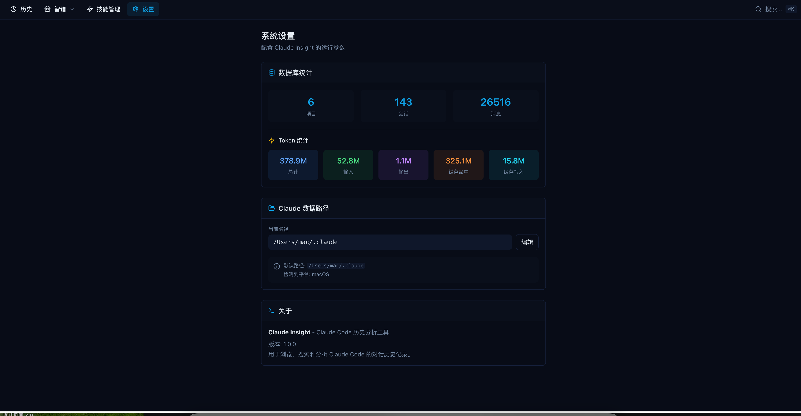

# Claude Insight

完全本地化Claude AI 对话历史管理和分析工具，帮助开发者管理和回顾与 Claude 的对话历史。

> ⚠️ **注意**：统计数据和会话数据不一定全面，以真实数据为准。

## 功能特性

- **历史记录扫描与管理** - 自动扫描和管理 Claude 对话历史
- **项目管理** - 管理多个项目的对话记录
- **会话查看与搜索** - 快速浏览和搜索历史会话
- **模型配置管理** - 管理不同的 Claude 模型配置
- **技能管理** - 管理自定义技能和工作流
- **工作区管理** - 灵活的工作区配置

## 技术栈

### 后端
- [Fastify](https://fastify.dev/) - 高性能 Web 框架
- [TypeScript](https://www.typescriptlang.org/) - 类型安全

### 前端
- [Vue 3](https://vuejs.org/) - 渐进式 JavaScript 框架
- [TypeScript](https://www.typescriptlang.org/) - 类型安全
- [Vite](https://vitejs.dev/) - 下一代前端构建工具
- [Radix Vue](https://www.radix-vue.com/) - 无样式 UI 组件库
- [Tailwind CSS](https://tailwindcss.com/) - 实用优先的 CSS 框架
- [Pinia](https://pinia.vuejs.org/) - Vue 状态管理
- [Monaco Editor](https://microsoft.github.io/monaco-editor/) - 代码编辑器
- [Chart.js](https://www.chartjs.org/) - 图表库

### 包管理
- [pnpm](https://pnpm.io/) - 快速、磁盘空间高效的包管理器 (Monorepo)

## 项目结构

```
claude-insight/
├── backend/          # 后端服务
│   └── src/          # 源代码
├── frontend/         # 前端应用
│   ├── src/          # 源代码
│   └── public/       # 静态资源
└── package.json      # Monorepo 配置
```

## 快速开始

### 环境要求

- Node.js >= 18.0.0
- pnpm >= 8.0.0

### 安装

```bash
pnpm install
```

### 运行

```bash
# 并行运行前后端
pnpm dev

# 单独运行后端
pnpm dev:backend

# 单独运行前端
pnpm dev:frontend
```

后端服务默认运行在 `http://localhost:3000`，前端开发服务器默认运行在 `http://localhost:5173`。

## 开发命令

| 命令 | 说明 |
|------|------|
| `pnpm dev` | 并行运行前后端开发服务器 |
| `pnpm build` | 构建前后端项目 |
| `pnpm lint` | 代码检查 |
| `pnpm typecheck` | 类型检查 |
| `pnpm clean` | 清理构建产物 |

## links
[linux.do](https://linux.do/t/topic/1794151/9)

## 页面





